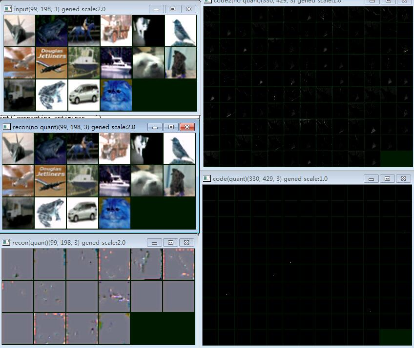
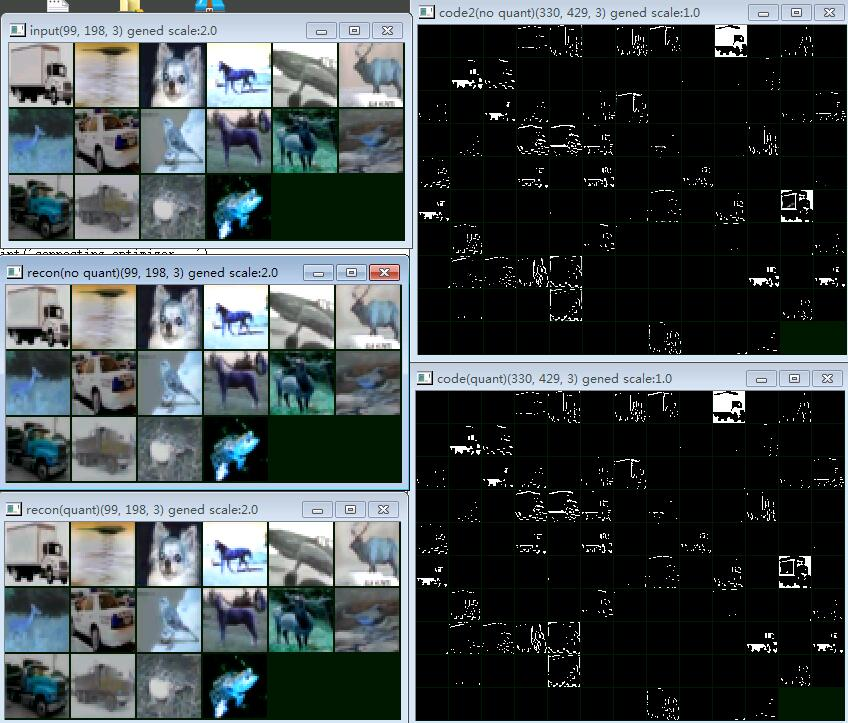

# CNN Image Compression - Neural Network Image Compression


> Reading this article requires basic convolutional neural network knowledge.

The best way to encode a binary string is Huffman's method. The entropy of different binary strings is different, and the length after encoding using the Huffman method is also different, that is, the compression ratio is different.

Here are two strings of binary:

100001001000000000 - 10010110101101010001

For the Huffman method, the first string is easier to compress than the second string, resulting in a shorter compressed length.

Lossy compression of media data in two steps:

1. The media data through certain methods, converted into 0 or 1 more of a binary representation.
2. Huffman encoding of the results, to achieve compression.

JPEG does this:

1. Divide the image into several 8x8 tiles
2. Convert 8x8 2D images to 64x1 one-dimensional images
3. DFT the 64x1 image to get the amplitude and phase at different frequencies
4. Excluding the smaller items in the DFT results (assuming the human eye is insensitive to these items), the result is that more 0s can be compressed by the Huffman method to be smaller
5. Huffman encoding of the results, to achieve compression.

JPEG This method has many disadvantages. After the DFT reject term, the value of the pixel at the edge changes, causing the image to be discontinuous. The most notable feature of a JPEG-compressed image is its ability to see a large number of 8x8 mosaic tiles in the image.

Can not cut the image into a piece of a binary string, but the entire image is continuously converted into a large bitmap it? Well, you can try it with Convolutional Neural Network (CNN).

To convert the image to a binary string and then convert it back, two CNNs are needed, one responsible for encoding (image -> 0-1 bitmap) and one for decoding (0-1 bitmap -> image).

Training architecture (green arrows indicate error reduction as a target, update parameters):

<dot
digraph{
  "image(3通道)" -> "Encoder CNN(3->128通道)" -> "sigmoid" -> "Decoder CNN(128->3通道)" -> "MSE(均方差)"
  "image(3通道)" -> "MSE(均方差)" -> loss
  loss->"Encoder CNN(3->128通道)"[color=green,constraint=false]
  loss->"Decoder CNN(128->3通道)"[color=green,constraint=false]
}
/>

Which sigmoid function is the role of the encoder output is limited to between 0 and 1. To make the network more output 0 and less output 1 (for compression), I added a penalty on the generated binary:

```python
loss = tf.reduce_mean((y-x)**2) + tf.reduce_mean(binary_code**2) * 0.01
```

This structure becomes：

<dot
digraph{
  image -> "Encoder CNN" -> "sigmoid" -> "Decoder CNN" -> "MSE(均方差)"
  image -> "MSE(均方差)" -> loss
  loss->"Encoder CNN"[color=green,constraint=false]
  loss->"Decoder CNN"[color=green,constraint=false]
  "sigmoid" -> "N^2" -> loss
}
/>

After the training began, the situation is this:



From left to right:

- Input image (3 channels in total)
- The decoded image is output from sigmoid
- The sigmoid output is binarized and then the decoded image

Right from top to bottom:

- sigmoid output (generated by the first figure on the left, a total of 128 channels)
- sigmoid output, after binarization

A closer look can be seen, sigmoid output is not used 0 and 1, but in different shades of gray that information, and decoder from these shades of gray restore the image. If we binarize the sigmoid output, the information is completely lost. So how can we force neural networks to represent information using 0 and 1 rather than other values ​​between 0 and 1?

The answer is to increase the noise!

If we add Gaussian noise before the sigmoid function, then the encoder and decoder will start to find out that with gray unreliable, only information encoded with 0 and 1 can resist noise.

After adding Gaussian noise, the architecture becomes like this:

<dot
digraph{
  gaussian -> sum[color=brown,constraint=false]
  image -> "Encoder CNN" -> sum -> "sigmoid" -> "Decoder CNN" -> "MSE(均方差)"
  image -> "MSE(均方差)" -> loss
  "sigmoid" -> "N^2" -> loss

  { rank=same; gaussian sum }

  loss->"Decoder CNN"[color=green,constraint=false]
  loss->"Encoder CNN"[color=green,constraint=false]
}
/>

The noise standard deviation transferred to 15, the training effect is as follows:



Can see that the network has learned to use binary dither to encode the image content, the binary output is not done on the sigmoid little difference.
